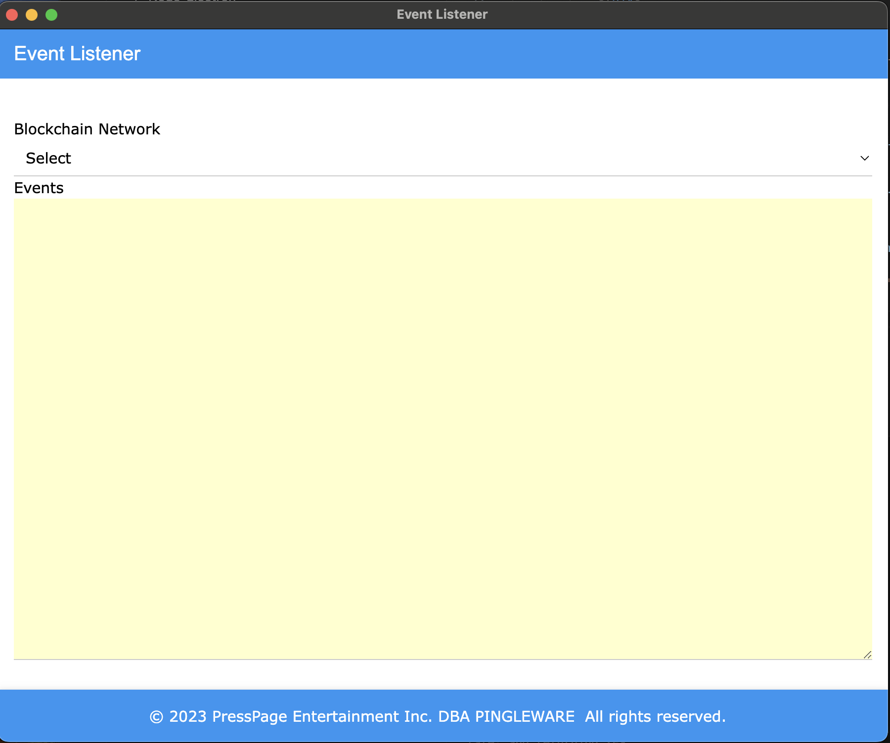

# Event Listener

The Event Listener will listen to the event notifications sent by the framework regardless on which blockchain the framework is deployed.

## Events

| Group          | Sub-Group | File                  | Event                       | Arguments                                                                                         |
| -------------- | --------- | --------------------- | --------------------------- | ------------------------------------------------------------------------------------------------- |
| agriculture    |           |                       |                             |                                                                                                   |
|                |           | AgriChain.sol         |                             |                                                                                                   |
|                |           |                       | ProductAdded                | uint prodId, string pname, string pstatus, string pcurLoc, bytes32 hash                           |
| aircraft       |           |                       |                             |                                                                                                   |
|                |           | AircraftOwnership.sol |                             |                                                                                                   |
|                |           |                       | Transfer                    | address sender, address receiver, uint amount                                                     |
| common         |           |                       |                             |                                                                                                   |
|                |           | Account.sol           |                             |                                                                                                   |
|                |           |                       | AccountBalanceTransfer      | address sender,address receiver,uint256 amount                                                    |
|                |           |                       | AccountTransfer             | address sender,address receiver,uint256 amount                                                    |
|                |           | Destructible.sol      |                             |                                                                                                   |
|                |           |                       | Destroyed                   | address sender, address recipient                                                                 |
|                |           |                       | Termination                 | address sender, string reason                                                                     |
|                |           | Frozen.sol            |                             |                                                                                                   |
|                |           |                       | Started                     | address sender, string reason                                                                     |
|                |           |                       | Stopped                     | address sender, string reason                                                                     |
|                |           | IdentityRegistry.sol  |                             |                                                                                                   |
|                |           |                       | IdentityAdded               | address indexed addressAdded, string identityHash, address indexed authorizedBy                   |
|                |           |                       | IdentityUpdated             | address indexed updatedAddress, string previousHash, string newHash, address indexed authorizedBy |
|                |           | Owned.sol             |                             |                                                                                                   |
|                |           |                       | FallbackEvent               | address sender, uint256 amount                                                                    |
|                |           |                       | ReceiveEvent                | address sender, uint256 amount                                                                    |
|                |           |                       | OwnershipTransferred        | address indexed previousOwner, address indexed newOwner                                           |
|                |           | Whitelistable.sol     |                             |                                                                                                   |
|                |           |                       | AddressAddedToWhitelist     | address indexed AuthorizedBy, address indexed AddressAdded                                        |
|                |           |                       | AddressRemovedFromWhitelist | address indexed AuthorizedBy, address indexed AddressRemoved                                      |
| education      |           |                       |                             |                                                                                                   |
| energy         |           |                       |                             |                                                                                                   |
|                |           | EETP.sol              |                             |                                                                                                   |
|                |           |                       | bought                      | bytes32 trans, address buyer                                                                      |
|                |           |                       | confirmed                   | bytes32 trans, address buyer                                                                      |
|                |           | EnergyStore.sol       |                             |                                                                                                   |
|                |           |                       | producerRegistered          | address indexed producer                                                                          |
|                |           |                       | producerDeregistered        | address indexed producer                                                                          |
|                |           |                       | BidMade                     | address indexed producer, uint32 indexed day, uint32 indexed price, uint64 energy                 |
|                |           |                       | BidRevoked                  | address indexed producer, uint32 indexed day, uint32 indexed price, uint64 energy                 |
|                |           |                       | Deal                        | address indexed producer, uint32 indexed day, uint32 price, uint64 energy, uint32 indexed userID  |
|                |           |                       | DealRevoked                 | address indexed producer, uint32 indexed day, uint32 price, uint64 energy, uint32 indexed userID  |
| finance        |           |                       |                             |                                                                                                   |
|                | banking   |                       |                             |                                                                                                   |
|                | credit    |                       |                             |                                                                                                   |
|                | currency  |                       |                             |                                                                                                   |
|                | dao       |                       |                             |                                                                                                   |
|                | debt      |                       |                             |                                                                                                   |
|                | elmx      |                       |                             |                                                                                                   |
|                | equity    |                       |                             |                                                                                                   |
|                | rcex      |                       |                             |                                                                                                   |
|                | utility   |                       |                             |                                                                                                   |
| games          |           |                       |                             |                                                                                                   |
|                |           | InstantBingo.sol      |                             |                                                                                                   |
|                |           |                       | GameCreated                 | uint256 game                                                                                      |
|                |           |                       | GameCardNumbersAdded        | uint256 game, uint256 card, uint256 formNumber, uint256 serialNo                                  |
|                |           |                       | GameTicketPurchase          | uint256 game, uint256 ticketNo, uint256 gameSerialNo                                              |
|                |           |                       | GameEnded                   | uint256 game, uint256 winningNumber                                                               |
|                |           |                       | GamePrizeClaimed            | uint256 game, address winner, uint256 amount                                                      |
|                |           |                       | ContractBalanceWithdrawn    | uint256 balance                                                                                   |
|                |           |                       | MoniesReceived              | address sender, uint256 amount                                                                    |
| government     |           |                       |                             |                                                                                                   |
|                |           | BusStop.sol           |                             |                                                                                                   |
|                |           |                       | BusStopAdded                |                                                                                                   |
|                |           |                       | BusStopUpdated              |                                                                                                   |
|                |           | Case.sol              |                             |                                                                                                   |
|                |           |                       | NewCaseCreated              | string caseIndex, address plaintiff, address defendant, string description                        |
|                |           |                       | CaseAssignedJudge           | string caseIndex, address judge                                                                   |
|                |           |                       | LegalRepresentativeAssigned | string caseIndex, address representative                                                          |
|                |           | Courts.sol            |                             |                                                                                                   |
|                |           |                       | CaseFiled                   | string caseId, address plaintiff, address defendant, string description, uint256 filingDate       |
|                |           |                       | CaseResolved                | string caseId                                                                                     |
|                | county    |                       |                             |                                                                                                   |
|                | federal   |                       |                             |                                                                                                   |
|                | municipal |                       |                             |                                                                                                   |
|                | state     |                       |                             |                                                                                                   |
| healthcare     |           |                       |                             |                                                                                                   |
|                | pharma    |                       |                             |                                                                                                   |
| hospitality    |           |                       |                             |                                                                                                   |
| insurance      |           |                       |                             |                                                                                                   |
| interfaces     |           |                       |                             |                                                                                                   |
| legal          |           |                       |                             |                                                                                                   |
| libs           |           |                       |                             |                                                                                                   |
| membership     |           |                       |                             |                                                                                                   |
| news           |           |                       |                             |                                                                                                   |
| nft            |           |                       |                             |                                                                                                   |
| non-profit     |           |                       |                             |                                                                                                   |
| realestate     |           |                       |                             |                                                                                                   |
| retail         |           |                       |                             |                                                                                                   |
| scm            |           |                       |                             |                                                                                                   |
| social         |           |                       |                             |                                                                                                   |
| technology     |           |                       |                             |                                                                                                   |
| transportation |           |                       |                             |                                                                                                   |
