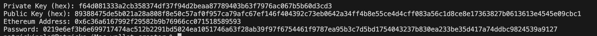
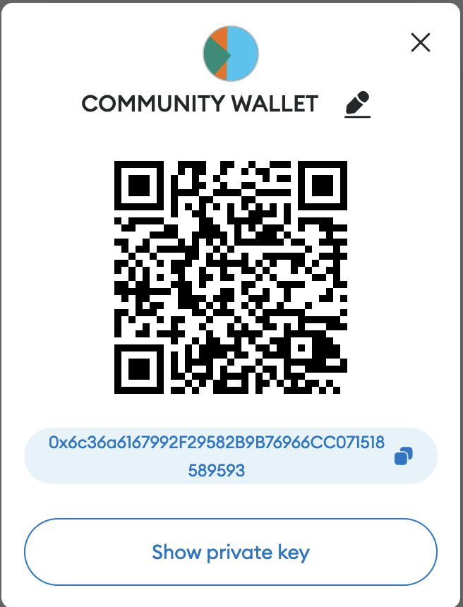
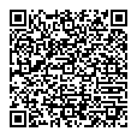

# Wallet Creator

A standalone application that will create an ethereum wallet address with public and private keys and create a sign hash from a string message that can be used as a password when authenticating. The password should be stored in an off chain database with reference to the wallet address. DO NOT STORE THE PRIVATE KEYS IN THE OFF CHAIN DATABASE.

The public and private keys along with the wallet are sent to the user via a secured method. The user will import their new wallet into metamask using the private key.



The above wallet is real and generated by this application, will work on the ethereum-based blockchain but do not use it for live transactions. A QR code below is provided to import the Community Wallet into Metamask.

See on etherscan.io at [https://etherscan.io/address/0x6c36a6167992f29582b9b76966cc071518589593](https://etherscan.io/address/0x6c36a6167992f29582b9b76966cc071518589593)

The wallet imported into metamask as a COMMUNITY WALLET,



The COMMUNITY WALLET has a single Goerli Test Token for the Ethereum Smart Contract Creator at [https://testnets.opensea.io/assets/goerli/0xf4910c763ed4e47a585e2d34baa9a4b611ae448c/36333753202514414869774196218446368102124864803313914227828195908039628392096](https://testnets.opensea.io/assets/goerli/0xf4910c763ed4e47a585e2d34baa9a4b611ae448c/36333753202514414869774196218446368102124864803313914227828195908039628392096). You can download the application from [https://snapcraft.io/ethereum-contract-creator](https://snapcraft.io/ethereum-contract-creator), which requires a Goerli Test Token to gain access to the beta version available on snapcraft.io. You can always use your own wallet on the Goerli test network, request free test ether and buyu your own test token from the llink above. You will want to rename the newly import Community Wallet by pressing the pencil edit icon and use the name COMMUNITY WALLET.

You must import the community wallet into your metamask account using the above private key and set that wallet as the active wallet. Then download and launch the application. The first launch will setup your environment variables in a JSON file under your user directory, then subsequent launches require connecting to metamask with the Community Wallet (or your own wallet with a vallid license), that signs a message and starts the local blockchain.

## Associating an Account Number with a Wallet Address

A primary account with expiration date and cvv code is created from the wallet address using the Luhn algorithm, the same used for creating card numbers,

```
Private Key (hex): 8d34366b466a8b832af33e28ade7867621d5dd59367ea5aaa0066a2e7b2ea2d7
Public Key (hex): 5c785344703f16bf6f2dd4b0eadba82d8a3ae7514a2992df5476d59894166f7e07388c5dc373b6a4f8b276ab87a9f437554fc80649d216d89c4b9e3d14f85a77
Ethereum Address: 0xae065401c5acd15b1918abad43aa4be2bfb8c1e6
Primary Account Number: 9840600009935055166
Expiration Date: 1128
CVV: 219
CVK: 0xfe7fb097e6b90cf469f837d2bc5171b4c14b5595a3567d816008129acf9b527b
Service Code: 999
Password: 0e53be539578dec2494f7b9fa99f5b44561b906e69a34cf952d3bbfbe1d79ea84cf43d71d00ca8fad2be66f52eb8e66091229ed0854c4c40008cc2d6f4bb00ef27
Mnemonic: teach piece peace cliff history electric valid system tackle float debris pool
QR code saved as 9840600009935055166.png
```

and creates the file identified by the primary account number,

`9840600009935055166.json`

```
{
    "PAN": "9840600009935055166",
    "EXP": "1128",
    "CVV": "219",
    "CVK": "0xfe7fb097e6b90cf469f837d2bc5171b4c14b5595a3567d816008129acf9b527b",
    "SVC": "999",
    "ADDRESS": "0xae065401c5acd15b1918abad43aa4be2bfb8c1e6",
    "PUBLICKEY": "8d34366b466a8b832af33e28ade7867621d5dd59367ea5aaa0066a2e7b2ea2d7",
    "PRIVATEKEY": "5c785344703f16bf6f2dd4b0eadba82d8a3ae7514a2992df5476d59894166f7e07388c5dc373b6a4f8b276ab87a9f437554fc80649d216d89c4b9e3d14f85a77",
    "PASSWORD": "0e53be539578dec2494f7b9fa99f5b44561b906e69a34cf952d3bbfbe1d79ea84cf43d71d00ca8fad2be66f52eb8e66091229ed0854c4c40008cc2d6f4bb00ef27",
    "MNEMONIC": "teach piece peace cliff history electric valid system tackle float debris pool"
}
```

containing the metadata above.

A QR Code for importing into metamask is also created as 9840600009935055166.png,



a wallet 9840600009935055166.wallet.json file is created for storage on an encrypted USB device.

```
{
    "wallet_name": "redeecash",
    "mnemonic_phrase": "teach piece peace cliff history electric valid system tackle float debris pool",
    "bip32_path": "m/44'/60'/0'/0",
    "accounts": [
        {
            "account_name": "0xae065401c5acd15b1918abad43aa4be2bfb8c1e6",
            "extended_public_key": "5c785344703f16bf6f2dd4b0eadba82d8a3ae7514a2992df5476d59894166f7e07388c5dc373b6a4f8b276ab87a9f437554fc80649d216d89c4b9e3d14f85a77",
            "balance": "",
            "transactions": []
        }
    ]
}
```

Associating an account number with an expiration date and CVV code to a wallet address can offer several benefits, particularly in the context of financial transactions and security. Here are some of the advantages:

1. Enhanced Security:

   - Verification: The CVV code serves as an additional layer of authentication, helping to verify the cardholder's identity during transactions. It adds a level of security beyond just the account number and expiration date.
   - Fraud Prevention: Combining these details makes it more difficult for unauthorized individuals to use the card information, reducing the risk of fraud and unauthorized transactions.
2. Reduced Unauthorized Access:

   - Expiration Date: The expiration date ensures that the cardholder has access to the card, and the associated funds are still valid for transactions.
   - Two-Factor Authentication: The combination of the CVV code and the other card details can be seen as a form of two-factor authentication, which provides an extra level of protection against unauthorized access.
3. Seamless Payment Experience:

   - Convenience: By associating these card details with a wallet address, users can make payments and transactions more quickly, as they don't have to enter this information repeatedly.
   - Efficiency: The wallet address becomes a centralized hub for managing payment methods, streamlining the checkout process for online purchases.
4. Better Record-Keeping:

   - Tracking and Management: Associating card details with a wallet address allows users to keep track of their payment methods more easily. This can help with monitoring spending, managing subscriptions, and simplifying financial management.
5. Cross-Platform Usage:

   - Multiple Devices: Wallet addresses can often be used across different devices, making it easier for users to access their payment methods on smartphones, tablets, and computers.
   - Cross-Platform Consistency: Card information can be updated once and applied to multiple platforms, ensuring consistency and minimizing the need to update payment information in multiple places.
6. Faster Transaction Processing:

   - Instant Verification: The stored card details can help expedite transaction processing, as the verification process is smoother and quicker.
   - Reduced Checkout Friction: With the card information readily available, users can complete purchases more efficiently, which is particularly useful in e-commerce and online services.

It's important to note that while there are benefits to associating card details with a wallet address, this practice also carries some security risks. If the wallet address is compromised, it could potentially lead to unauthorized access to the card details. Therefore, strong security measures and encryption protocols should be in place to protect this sensitive information and safeguard user privacy.

## Use Case

You have an ecommerce that you cotnrol the inventory and wish to offer attractive financing to your customers.

A customer provides personal identifying information on your secured website, using a proven KYC process, a new crpytocurrency wallet is created with an associated primary account number (PAN) with expiration date and CVV code that the customer can use on your website.

The customer can use a third party money transmitter service to add ether to their new wallet and use those funds to make a payment on their account (PAN). The customer can log into their account by providing the PAN and connecting their cryptocurrency wallet to sign a message containing both the PAN and wallet address, which is verified on the server side.

Once login is successful, the customer can see their balance and when a they want to make a payment, they initiate a payment through the metamask wallet using their wallet address to send funds to be credited on their account.

If you have a physical store, importing the PAN with expiration date and CVV code to Apple, Samsung, Google wallets, you can customer can make an in store purchase using their account number, if you do not accept cryptocurrency directly.

### Debt Offering

Using an exempt offering under Regulation A Tier 1, Regulation D 506(c) or an intrastate offering under Section 3(a)(11) or Rule 147|147-A, you can solicit investors to provide the reserves for the customers credit accounts. Both [Redeecash Exchange](https://redeecash.exchange) and [Exempt Liquidity Market Exchange](https://exemptliquiditymarket.exchange) is a future SEC regulated NMS for exempt offerings.

## TODO

* Create a cold storage wallet for the Community Wallet on a hardware USB wallet that can interact with metamask. See [https://hackernoon.com/how-to-create-a-cold-storage-crypto-wallet-with-a-usb-memory-stick](https://hackernoon.com/how-to-create-a-cold-storage-crypto-wallet-with-a-usb-memory-stick)
* Add the Community Wallet PAN to Apple, Google, Samsung digital wallet.

## Why a Community Wallet

Help with adoption of using an NFT as a software license as well as wallet for user authentication. When a new application is release as BETA and is using wallet authentication, a Community Wallet permits access without using a private funded wallet, such as the BETA version of the [Ethereum Smart Contract Creator]([https://snapcraft.io/ethereum-chttps://snapcraft.io/ethereum-contract-creator).

## Benefits of a NFT Software License

Permits perpetual licensing on a public immutable blockchain. Microsoft moved from CD Keys to Server activation for Windows XP and Windows 7, but if you want to install or reinstall Windows 7 using your install media and license key, there is no Windows 7 license server available in 2023+ to activate the system and Windows 7 ceases to function thrity days later.

Using a NFT software license, there is no license activation server and planned obsolence doesn't apply, but adopts an immortal EOL doctrine. When a piece of software is useful, there should never be a End-Of-Life (EOL) doctrine or use the planned obsolence model.
