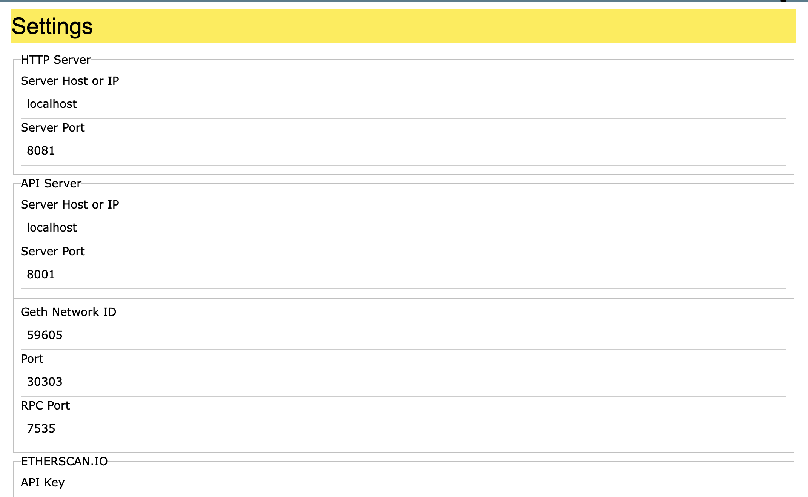

# Testing

Unit testing ensures that the contracts are operating per design and provide implementation guidance including required dependencies.

Each test case is created for each Contract and not for abstract contracts, interfaces nor libraries as these cannot be instantiated, by using the command,

```
truffle create test <CONTRACT NAME>
```

the test file contains the basic deploy test, and additional tests are related to the contract under test,

```
const Contract = artifacts.require("CONTRACT NAME");

/*
 * uncomment accounts to access the test accounts made available by the
 * Ethereum client
 * See docs: https://www.trufflesuite.com/docs/truffle/testing/writing-tests-in-javascript
 */
contract("CONTRACT NAME", function (/* accounts */) {
  it("should assert true", async function () {
    await Contract.deployed();
    return assert.isTrue(true);
  });
});

```

You can use the Ethereum Contract Creator, and from the settings dialog obtain the RPC host and port



Then edit truffle-config.js,

```
development: {
      host: "localhost",     // Localhost (default: none)
      port: 7535,            // Standard Ethereum port (default: none)
      network_id: "*",       // Any network (default: none)
    },

// IMPORTANT: change the following path to the contracts you want to test
  contracts_directory: './contracts/government/county/',

  // Set default mocha options here, use special reporters, etc.
  mocha: {
    // timeout: 100000
  },

  // Configure your compilers
  compilers: {
    solc: {
      version: "0.8.18",      // Fetch exact version from solc-bin (default: truffle's version)
      // docker: true,        // Use "0.5.1" you've installed locally with docker (default: false)
      settings: {          // See the solidity docs for advice about optimization and evmVersion
        optimizer: {
          enabled: true,
          runs: 1
        },
        evmVersion: "byzantium"
      }
    }
  },
```

To start test, change to the root directory, edit the contracts_directory value on truffle-config.js to the contract directory under test,

```
truffle compile
```

then issue the migrate and test command, the migrate and test commands are not dependent on the contracts_directory setting in truffle-config.js,

```
truffle migrate --reset
truffle test
```

## Truffle Test

```

Usage:        truffle test [<test_file>] [--compile-all[-debug]] [--compile-none] [--migrate-none] [--network <name>]
                             [--verbose-rpc] [--show-events] [--debug] [--debug-global <identifier>] [--bail|-b]
                             [--stacktrace[-extra]] [--grep|-g <regex>] [--reporter|-r <name>]  [--network <name>] [--config <file>]
  Description:  Run JavaScript and Solidity tests
  Options: 
                <test_file>
                    Name of the test file to be run. Can include path information if the file does not exist in the
                    current directory.
                --compile-all
                    Compile all contracts instead of intelligently choosing which contracts need to be compiled.
                --compile-none
                    Do not compile any contracts before running the tests
                --compile-all-debug
                    Compile all contracts and do so in debug mode for extra revert info.  May cause errors on large
                    contracts.
                --migrate-none
                    Do not migrate any contracts before running the tests.
                --verbose-rpc
                    Log communication between Truffle and the Ethereum client.
                --show-events
                    Log all contract events.
                --debug
                    Provides global debug() function for in-test debugging. JS tests only; implies --compile-all.
                --debug-global <identifier>
                    Specify global identifier for debug function. Default: "debug"
                --runner-output-only
                    Suppress all output except for test runner output.
                --bail|-b
                    Bail after first test failure.
                --stacktrace
                    Allows for mixed JS/Solidity stacktraces when a Truffle Contract transaction or deployment
                    reverts.  Does not apply to calls or gas estimates.  Implies --compile-all.  Experimental.  Alias: -t
                --stacktrace-extra
                    Shortcut for --stacktrace --compile-all-debug.
                --grep|-g
                    Use mocha's "grep" option while running tests. This option only runs tests that match the supplied regex/string.
                --reporter|-r <name>
                    Specify the type of mocha reporter to use during testing. Default: 'spec'
                --network <name>
                    Specify the network to use. Network name must exist in the configuration.
                --config <file>
                    Specify configuration file to be used. The default is truffle-config.js
```

## Single Test

To conduct a test on a single file, change to the test directory then,

```
truffle test agri_trade.js --compile-none --migrate-none --network development
```

if the contract has already been compiled and deployed

## Contract Test Status

The following table created for tracking status when each contract has completed and passed testing. When a contract has passed the testing, that contract is considered to be stable. When all contracts are considered stable, this package will be released as stable.

| Group                   | Sub-Group | Name                          | Complete | Pass | Count | Migration Number |
| :---------------------- | --------- | ----------------------------- | :------: | :--: | :---: | :--------------: |
| Agriculture             |           |                               |          |      |      |                  |
|                         |           | AgriChain                     |    Y    |  Y  |      |    1697931418    |
|                         |           | AgriTrade                     |    N    |  N  |      |    1697948405    |
| Aviation                |           |                               |          |      |      |                  |
|                         |           | AircraftOwnership             |    Y    |  N  |      |    1697951611    |
| Education               |           |                               |          |      |      |                  |
|                         |           | Course                        |    Y    |  Y  |      |    1698151437    |
|                         |           | EducationRoles                |    Y    |  Y  |      |    1698151468    |
|                         |           | Lesson                        |    Y    |  Y  |      |    1698151485    |
|                         |           | Transcripts                   |    Y    |  N  |      |    1697951791    |
| Energy                  |           |                               |          |      |      |                  |
|                         |           | EETP                          |    N    |  N  |      |    1698162652    |
|                         |           | EnergyStore                   |    N    |  N  |      |    1698162661    |
|                         |           | RINS                          |    N    |  N  |      |    1698162667    |
| Finance                 |           |                               |          |      |      |                  |
|                         | Banking   |                               |          |      |      |                  |
|                         |           | PeerToPeerLending             |    N    |  N  |      |    1698160943    |
|                         |           | SavingsAccount                |    N    |  N  |      |    1698161109    |
|                         | Credit    |                               |          |      |      |                  |
|                         |           | CreditReportAgency            |    N    |  N  |      |    1698152467    |
|                         | Currency  |                               |          |      |      |                  |
|                         |           | Asian                         |    N    |  N  |      |    1698161319    |
|                         |           | Forward                       |    N    |  N  |      |    1698161345    |
|                         |           | Future                        |    N    |  N  |      |    1698161332    |
|                         |           | Option                        |    N    |  N  |      |    1698161351    |
|                         |           | Swap                          |    N    |  N  |      |    1698161338    |
|                         |           | Touch                         |    N    |  N  |      |    1698161356    |
|                         | DAO       |                               |          |      |      |                  |
|                         |           | WyomingDAO                    |    N    |  N  |      |    1698163091    |
|                         | Debt      |                               |          |      |      |                  |
|                         |           | CommercialPaper               |    N    |  N  |      |    1698163588    |
|                         |           | DebtToken                     |    N    |  N  |      |    1698165642    |
|                         |           | ExemptDebtOffering            |    N    |  N  |      |    1698163602    |
|                         |           | ExemptDebtOfferingStaking     |    N    |  N  |      |    1698163618    |
|                         |           | SimpleBond                    |    N    |  N  |      |    1698163627    |
|                         |           |                               |          |      |      |                  |
|                         | ELMX      |                               |          |      |      |                  |
|                         |           | BestBooks                     |    Y    |  N  |   9   |    1697952628    |
|                         |           | BondCertificate               |    Y    |  N  |   7   |    1697952638    |
|                         |           | ConsolidatedAuditTrail        |    Y    |  N  |   9   |    1697934206    |
|                         |           | ELMXMunicipalBond             |    N    |  N  |      |    1698150398    |
|                         |           | EncryptionUtils               |    Y    |  Y  |   5   |    1697952652    |
|                         |           | ExchangeFee                   |    Y    |  N  |   4   |    1698116231    |
|                         |           | ExemptLiquidityMarketExchange |    N    |  N  |      |    1697932593    |
|                         |           | ExchangeTradedFund            |    N    |  N  |   6   |    1698361276    |
|                         |           | InvestorManager               |    Y    |  Y  |  24  |    1697952660    |
|                         |           | OrderBook                     |    N    |  N  |      |    1697984615    |
|                         |           | PaymentWallet                 |    Y    |  Y  |  16  |    1697952603    |
|                         |           | Reg3A11Debt                   |    N    |  N  |      |    1697952710    |
|                         |           | Reg3A11Equity                 |    N    |  N  |      |    1697952726    |
|                         |           | Reg147ADebt                   |    N    |  N  |      |    1697953023    |
|                         |           | Reg147AEquity                 |    N    |  N  |      |    1697953039    |
|                         |           | Reg147Debt                    |    N    |  N  |      |    1697953050    |
|                         |           | Reg147Equity                  |    N    |  N  |      |    1697953012    |
|                         |           | Reg701Equity                  |    N    |  N  |      |    1697953050    |
|                         |           | RegAT1Debt                    |    N    |  N  |      |    1697952880    |
|                         |           | RegAT1Equity                  |    N    |  N  |      |    1697952894    |
|                         |           | RegD506CDebt                  |    N    |  N  |      |    1697953123    |
|                         |           | RegD506CEquity                |    N    |  N  |      |    1697953109    |
|                         |           | SecurityMeta                  |    Y    |  N  |   9   |    1697953147    |
|                         |           | StockCertificate              |    N    |  N  |      |    1698149824    |
|                         |           | TokenManager                  |    Y    |  Y  |   8   |    1697953165    |
|                         | Equity    |                               |          |      |      |                  |
|                         |           | ATS                           |    N    |  N  |      |    1697953240    |
|                         |           | CPAMM                         |    N    |  N  |      |    1697953272    |
|                         |           | DelawareStockToken            |    N    |  N  |      |    1697953300    |
|                         |           | DirectEquityOffering          |    N    |  N  |      |    1697953329    |
|                         |           | ExemptEquityOffering          |    N    |  N  |      |    1697953346    |
|                         |           | ICO                           |    N    |  N  |      |    1697953361    |
|                         | Utility   |                               |          |      |      |                  |
|                         |           | BAToken                       |    N    |  N  |      |    1697953390    |
| Government              |           |                               |          |      |      |                  |
|                         | Federal   |                               |          |      |      |                  |
|                         |           | Congress                      |    N    |  N  |      |    1697974620    |
|                         |           | HouseOfRepresentatives        |    N    |  N  |      |    1697974658    |
|                         |           | Immigration                   |    N    |  N  |      |    1697974685    |
|                         |           | IRS                           |    N    |  N  |      |    1697974708    |
|                         |           | POTUS                         |    N    |  N  |      |    1697974725    |
|                         |           | SCOTUS                        |    N    |  N  |      |    1697974743    |
|                         |           | USSenate                      |    N    |  N  |      |    1697974766    |
|                         | State     |                               |          |      |      |                  |
|                         |           | StateGovernment               |    N    |  N  |      |    1697974593    |
|                         | County    |                               |          |      |      |                  |
|                         |           | CountyBusStops                |    N    |  N  |      |    1697947660    |
|                         |           | CountyGovernment              |    N    |  N  |      |    1697953606    |
|                         |           | CountyJail                    |    N    |  N  |      |    1697954140    |
|                         | Municipal |                               |          |      |      |                  |
|                         |           | MunicipalGovernment           |    N    |  N  |      |    1698169854    |
|                         |           | MunicipalJail                 |    N    |  N  |      |    1698169867    |
|                         |           | MunicipalBond                 |    N    |  N  |      |    1697974514    |
|                         |           | MunicipalBusStops             |    N    |  N  |      |    1697974555    |
| Healthcare              |           |                               |          |      |      |                  |
|                         |           | Healthcare                    |    N    |  N  |      |    1697974848    |
|                         |           | PersonalInfo                  |    N    |  N  |      |    1697974875    |
|                         | Pharma    |                               |          |      |      |                  |
|                         |           | SampleGuardian                |    N    |  N  |      |    1697974823    |
| Hospitality             |           |                               |          |      |      |                  |
|                         |           | BlockchainBNB                 |    N    |  N  |      |    1697974924    |
| Insurance               |           |                               |          |      |      |                  |
|                         |           | AccidentHealth                |    N    |  N  |      |    1697979395    |
|                         |           | Annuities                     |    N    |  N  |      |    1697979421    |
|                         |           | Automobile                    |    N    |  N  |      |    1697979442    |
|                         |           | Captive                       |    N    |  N  |      |    1697979465    |
|                         |           | FloodInsurance                |    N    |  N  |      |    1697979491    |
|                         |           | HomeServiceWarranty           |    N    |  N  |      |    1697979523    |
|                         |           | Homeowners                    |    N    |  N  |      |    1697979547    |
|                         |           | LenderPlaced                  |    N    |  N  |      |    1697979569    |
|                         |           | Life                          |    N    |  N  |      |    1697979587    |
|                         |           | LongTermCare                  |    N    |  N  |      |    1697979604    |
|                         |           | MediGap                       |    N    |  N  |      |    1697979629    |
|                         |           | MotoreVehicleServiceAgreement |    N    |  N  |      |    1697979671    |
|                         |           | ProfessionalLiability         |    N    |  N  |      |    1697979701    |
|                         |           | Quote                         |    N    |  N  |      |    1697979719    |
|                         |           | ServiceWarranty               |    N    |  N  |      |    1697979741    |
|                         |           | SurplusLines                  |    N    |  N  |      |    1697979765    |
|                         |           | Title                         |    N    |  N  |      |    1697979780    |
|                         |           | WorkersCompensation           |    N    |  N  |      |    1697979802    |
| Legal                   |           |                               |          |      |      |                  |
|                         |           | Arbitration                   |    N    |  N  |      |    1697974971    |
|                         |           | DisputeResolution             |    N    |  N  |      |    1697974995    |
| Membership              |           |                               |          |      |      |                  |
|                         |           | Membership                    |    N    |  N  |      |    1697979845    |
| News                    |           |                               |          |      |      |                  |
|                         |           | NewsFeed                      |    N    |  N  |      |    1697979869    |
| NFT                     |           |                               |          |      |      |                  |
|                         |           | NFT                           |    N    |  N  |      |    1697979894    |
|                         |           | NFTCollection                 |    N    |  N  |      |    1697979907    |
| Non-Profit              |           |                               |          |      |      |                  |
|                         |           | Donation                      |    N    |  N  |      |    1697979939    |
|                         |           | TaxExemptBond                 |    N    |  N  |      |    1697979962    |
| Real Estate             |           |                               |          |      |      |                  |
|                         |           | RealEstate                    |    N    |  N  |      |    1697979993    |
|                         |           | Records                       |    N    |  N  |      |    1697980007    |
| Retail                  |           |                               |          |      |      |                  |
|                         |           | Classifieds                   |    N    |  N  |      |    1697980089    |
|                         |           | Inventory                     |    N    |  N  |      |    1697980107    |
|                         |           | Pawn                          |    N    |  N  |      |    1697980121    |
|                         |           | RetailInstalmentSales         |    N    |  N  |      |    1697980061    |
|                         |           | Store                         |    N    |  N  |      |    1697980135    |
|                         |           | TicketSales                   |    N    |  N  |      |    1697980152    |
| Supply Chain Management |           |                               |          |      |      |                  |
|                         |           | DistributorRole               |    N    |  N  |      |    1697980478    |
|                         |           | EndUserRole                   |    N    |  N  |      |    1697980502    |
|                         |           | ManufacturerRole              |    N    |  N  |      |    1697980529    |
|                         |           | ResellerRole                  |    N    |  N  |      |    1697980550    |
|                         |           | SupplierRole                  |    N    |  N  |      |    1697980593    |
|                         |           | SupplyChain                   |    N    |  N  |      |    1697980608    |
| Social                  |           |                               |          |      |      |                  |
|                         |           | SocialNetwork                 |    N    |  N  |      |    1697980657    |
| Technology              |           |                               |          |      |      |                  |
|                         |           | SoftwareLicense               |    N    |  N  |      |    1697980412    |
|                         |           | SoftwareLicenseMetadata       |    N    |  N  |      |    1697980427    |
| Transportation          |           |                               |          |      |      |                  |
|                         |           | Driver                        |    N    |  N  |      |    1697980880    |
|                         |           | Payment                       |    N    |  N  |      |    1697980909    |
|                         |           | RentalCar                     |    N    |  N  |      |    1697980933    |
|                         |           | RideshareTrade                |    N    |  N  |      |    1697980955    |
|                         |           | Transport                     |    N    |  N  |      |    1697980975    |
| **TOTALS**        |           |                               |          |      |  97  |                  |

Complete refers when the contract test script is fully implemented, while Pass refers to the contract passing the test.
